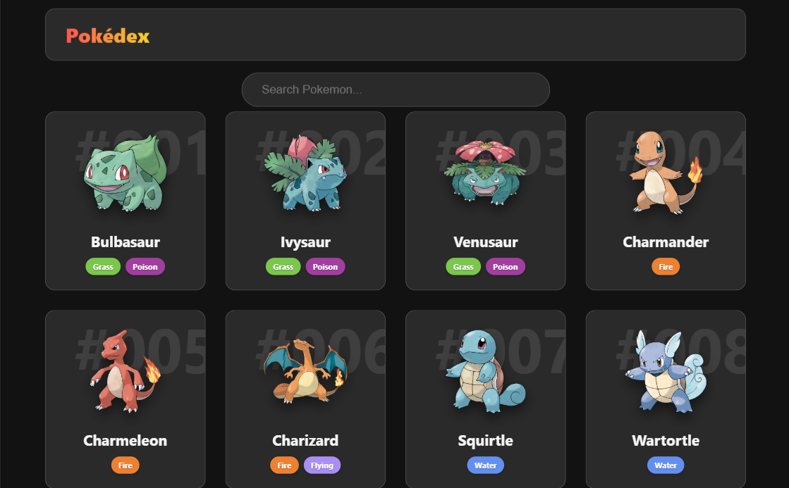
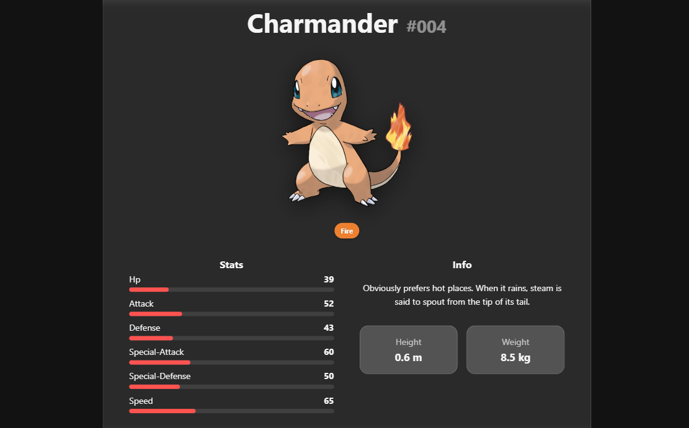
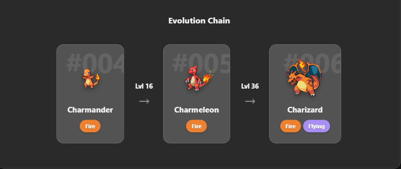

<div align="center">

<p>A fast, clean Pokémon explorer built with React. Browse the entire Pokédex, search by name, and dive into detailed stats, evolution chains, and physical characteristics.</p>
<strong><a href="https://pokedex-jet-pi.vercel.app" target="_blank">View Live Demo</a></strong>
</div>

---

## Screenshots

| Home — Pokémon Grid | Detail Page — Stats & Info | Detail Page — Evolution Chain |
| :---: | :---: | :---: |
|  |  |  |
| *Dark-themed grid with live search, Pokédex number watermarks, and color-coded type badges.* | *Full stat breakdown, Pokédex description, and height & weight.* | *Complete evolution chain with level requirements.* |

---

## Features

### Home Page
- **Live Search:** Filters Pokémon by name in real-time with partial matching. Search `char` for all Pokémon with "char" in their name, or `-mega` to instantly find every Mega Evolution. Includes a quick-clear (✕) button.
- **Pokémon Cards:** Each card displays the official sprite, name, a stylized Pokédex number watermark, and primary/secondary types.
- **Color-Coded Type Badges:** Distinct, recognizable colors for all elemental types (Fire, Grass, Poison, Flying, etc.) for quick visual scanning.

### Detail Page
- **Base Stats Breakdown:** HP, Attack, Defense, Special-Attack, Special-Defense, and Speed visualized through animated progress bars.
- **Pokédex Entry:** Official flavor text and lore description for each Pokémon.
- **Physical Info:** Height and weight metrics presented in a clean, isolated card layout.
- **Evolution Chain:** Visual representation of the full evolution line, complete with level requirements (e.g., Charmander → Lvl 16 → Charmeleon → Lvl 36 → Charizard).

### General Architecture
- **Optimized API Fetching:** Efficient data retrieval from PokéAPI using Axios alongside custom React hooks to manage loading states and caching.
- **Smooth Animations:** Fluid card transitions and page interactions powered by Framer Motion.
- **Responsive Layout:** UI adapts cleanly and scales perfectly across mobile, tablet, and desktop viewports.

---

## Tech Stack

| Technology | Purpose |
| :--- | :--- |
| **React 19** | Core UI framework |
| **Vite 7** | Build tool and development server |
| **Axios** | Client HTTP requests and API data fetching |
| **React Router DOM v7** | Client-side routing between home and detail views |
| **Framer Motion** | Complex UI animations and route transitions |
| **PokéAPI** | Primary RESTful data source |

---

## Getting Started

### Prerequisites

Ensure you have the following installed on your local machine:
- Node.js (v18 or higher)
- npm or yarn

### Installation & Setup

1. **Clone the repository**
```bash
git clone https://github.com/Asmit-64bit/Pokedex.git
cd Pokedex
```

2. **Install dependencies**
```bash
npm install
```

3. **Start the development server**
```bash
npm run dev
```

Open [http://localhost:5173](http://localhost:5173) to view the application in your browser.

### Build for Production

To generate a production-ready build, run:
```bash
npm run build
```

---

## Project Structure

```
Pokedex/
├── public/                        # Static assets served directly
│   ├── home.png                   # Screenshot — home page
│   ├── data1.png                  # Screenshot — detail page (stats & info)
│   ├── data2.png                  # Screenshot — detail page (evolution chain)
│   └── vite.svg                   # Vite default favicon
├── src/
│   ├── assets/                    # Images and static resources
│   ├── components/                # Reusable UI components
│   │   ├── Header.jsx             # App header with title
│   │   ├── Loader.jsx             # Loading spinner/state
│   │   ├── PokemonCard.jsx        # Individual Pokémon card (sprite, name, number, badges)
│   │   ├── PokemonList.jsx        # Grid of PokemonCard components
│   │   ├── SearchBar.jsx          # Live search input with clear button
│   │   └── TypeBadge.jsx          # Color-coded type pill (Fire, Grass, etc.)
│   ├── context/
│   │   └── PokemonContext.jsx     # Global state management via React Context
│   ├── hooks/
│   │   └── usePokemon.js          # Custom hook for PokéAPI data fetching & caching
│   ├── pages/
│   │   ├── Home.jsx               # Home page — search + Pokémon grid
│   │   └── PokemonDetails.jsx     # Detail page — stats, info, evolution chain
│   ├── App.jsx                    # Root component with route definitions
│   ├── App.css                    # Global app styles
│   ├── index.css                  # Base styles and CSS variables
│   └── main.jsx                   # React DOM entry point
├── index.html
└── package.json
```

---

## API

This project uses the free [PokéAPI](https://pokeapi.co/) — no API key required.

---

## License

This project is open source and available under the [MIT License](LICENSE).

---

<div align="center">
Built with ❤️ by <a href="https://github.com/Asmit-64bit">Asmit Samanta</a>
</div>